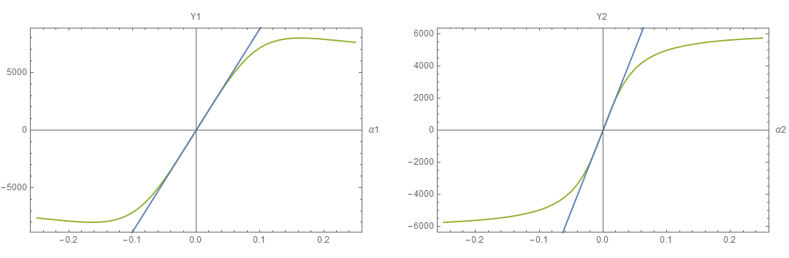

# Comparison-of-Different-Vehicle-Models
The purpose of this work is to make a comparison of Double Track, Single Track and Linear Single Track Model, and to show the differences in model behavior, especially when the corners are traveled at different speed.
First of all the Double Track Model is defined, then the Single Track model is defined starting from the Double Track, and finally the Linear Single Track Model is obtained simply by linearizing the **axle charactheristics** of the Single Track.

The project contains more files:
- Equations.nb is the Mathematica Notebook that contains all the equations used to describe the dynamics of the car;
- Main.nb is the Mathematica Notebook that contains the simulations of all models;
- in the folder Car_Parameters there are the parameters of the cars (in .json format).

To run the project is enough to evaluate the file Main.nb, after that will appear a choose dialog with which you can choose the parameters of the car in the folder Car_Parameters. 

The text taken as a reference is [**M. Guiggiani - "The Science of Vehicle Dynamics"** ](http://www.dimnp.unipi.it/guiggiani-m/science.html).

<h3>Double Track</h3>
<p>First of all the double model is defined. It is a quite complex model which includes the static toe and the Ackerman steering. It is defined by more than seventy equations which includes the steer angles, the slips, the Magic Formula, the aerodynamic forces and and obviusly all the equations of longitudinal, lateral and vertical dynamics.
 </p>
  
<h3>Single Track</h3>
<p>
The most interesting part concerns the derivation of the Single Track model by simplification of the Double Track model. In fact it is important to underline that the Single Track is obtained simplyfing the Double Track, and not viceversa.
</p>

The ipotheses made are the following:
- the Ackerman angle (dynamic toe) is equal to zero;
- the static toe is equal to zero;

Under these assumptions are defined the axle characteristics, that are two functions (one per axle) that give the total lateral force of the axle as a function of the slip angle only. This means that it is the sum of the forces of the left and right wheels, and obviously only one slip angle is considered, which is a sort of average value between the two wheels.
The steps to find the axle characteristics are explained in the [text-book](http://www.dimnp.unipi.it/guiggiani-m/science.html).

<figure class="image">
  
  <figcaption>Total lateral force for both axles (front in blue and rear in red)</figcaption>
</figure>
<br/>


This leads a unique relationship between lateral force, slip angle and lateral load transfer, as shown in the figure below. It is worth noting that in this way the lateral force of the single track model is totally independent from speed.

<figure class="image">
  
  <figcaption></figcaption>
</figure>

Finally the axle characteristic were fitting with Magic Formula.

<figure class="image">
  
  <figcaption></figcaption>
</figure>


<h3>Linear Single Track</h3>
To obtain the Linear Single Track model is sufficient to make the derivative of axle characteristic at point zero
 
```math
Y1 = C1*α1
Y2 = C2*α2
```
<figure class="image">
  
  <figcaption></figcaption>
</figure>

<h2>Comparison</h2>
